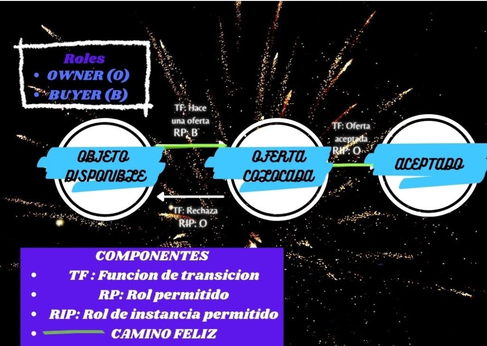

Quien-da-mas
====================================================================

Overview 
---------

Un repositorio adaptado en Smart Contract, dando ejemplo a un Mercado donde se subasta un articulo y genera un precio de oferta

Una aplicacion simple de mercado para una transaccion simple entre el vendedor del producto y el comprador.
En esta aplicacion existen dos roles, los cuales son el Comprador y el Vendedor.

Roles 
------------------
| Nombre                  | Descripcion                                       |
|------------------------|---------------------------------------------------|
|**Comprador** |Una persona que busca un articulo en el mercado |
|**Vendedor** |Una persona que coloca su articulo a la venta |

Existen 3 estados los cuales son **Articulo Disponible** que indica que un dueño puesto algun producto en venta, despues esta el **Precio Oferta** que indica que el vendedor ha propuesto una oferta para comprar el producto puesto por el dueño y finalmente tenemos el **Acceptado** que indica que el dueño ha aceptado la oferta que le hizo el c

Estados
-------

| Name                   | Description                                       |
|------------------------|---------------------------------------------------|
|**Articulo Disponible** |Indica que el vendedor ha colocado un nuevo articulo disponible en el mercado.
|**Precio Oferta** |Indica  el precio por el cual se esta dando el articulo disponible.
|**Acceptado** |Indica que el comprador ha aceptado el precio del articulo que coloca el vendedor.

Objetivos 
------------------
 **General**
   	Desarrollar un smart contract simple, que permite realizar compras, de tal modo que el comprador pueda regatear el precio con el vendedor. 

 **Específicos** 
   -Crear programa en IDE remix.
   -Mejoramiento y/o implementación de una nueva funcionalidad.
   -Demostración del proyecto en ejecución.
   
   
 

Flujo de trabajo
----------------
El flujo de trabajo es implementado por un código de GitHUb, colocado desde este link:

https://github.com/Azure-Samples/blockchain/tree/master/blockchain-workbench/application-and-smart-contract-samples/simple-marketplace
 

 
Application Files
-----------------

[SimpleMarketplace.json](./ethereum/SimpleMarketplace.json)

[SimpleMarketplace.sol](./ethereum/SimpleMarketplace.sol)
